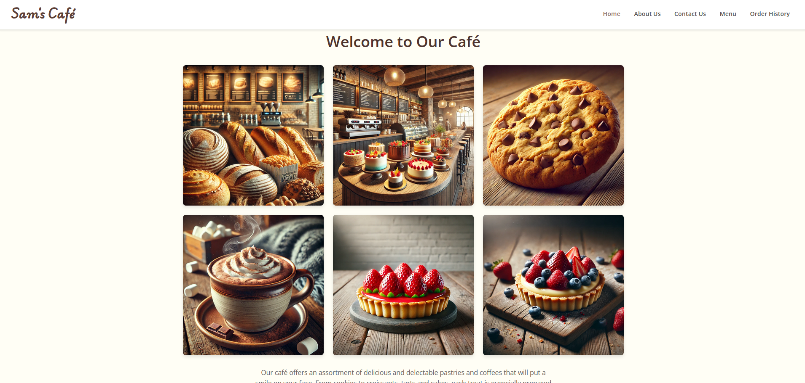
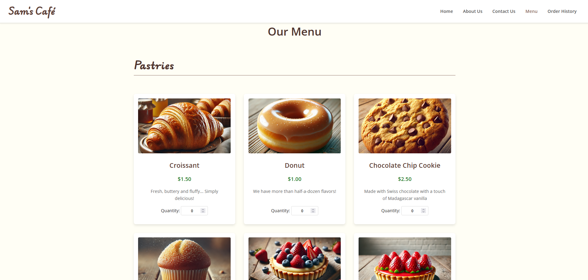
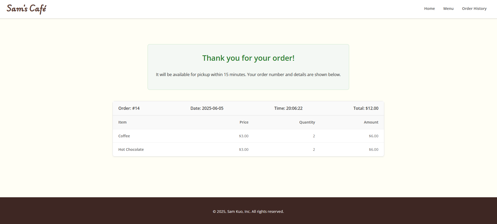

# Demo website
https://samkuo.click/samcafe/index.php

 
 
 
 

# AWS Architecture

# VPC

VPC Resource map

The infrastructure includes **4 subnets**:

- **2 Public Subnets**: These are accessible from the internet
- **2 Private Subnets**: These are isolated from direct internet access and are generally used for databases.

**Network ACLs (NACLs):**

- **Name:** `coffee-ACL`
- **Assigned to:** Public Subnets
- **Rules:** Allow **all inbound and outbound traffic**

- **Name:** `DB-ACL`
- **Assigned to:** Private Subnets
- **Rules:** Private subnets only allow MySQL/Aurora traffic over port 3306 

**Security Group**

- Database Security Group 

- allow traffic from CoffeeSG(MyBlog-SG)

- Coffee Security Group(MyBlog-SG)

- allow traffic from Public Network (HTTP, HTTPs, MySQL, SSH)

# EC2

Have two EC2 in us-west-1a and us-west-1c

# Auto Scaling Group

**Desired Capacity** : `2`

**Scaling Limits** : `2 - 4`

# Applicant Load Balancer

Resource map

ALB provides traffic distribution functionality at the HTTP and HTTPS layers, while ASG can automatically adjust the number of instances to respond to traffic fluctuations.

# RDS

Configure Multi-AZ Deployment with RDS Subnet Group

The subnets of the database subnet group include two subnets, **us-west-1a** and **us-west-1c**, which are located in different availability zones.

The database uses MariaDB.

The instance is deployed in the **us-west-1** region, specifically in the `1a` availability zone.

Publicly Accessible: `No`

# Route 53

Alias feature enabled, this record will point to CloudFront.

Using Smaple Route

# Cloudfront

The CloudFront distribution will use all available edge locations 
A custom domain name, `samkuo.click`, has been associated with the distribution.

A custom SSL certificate created with Certificate Manager is being used to ensure secure HTTPS connections.

