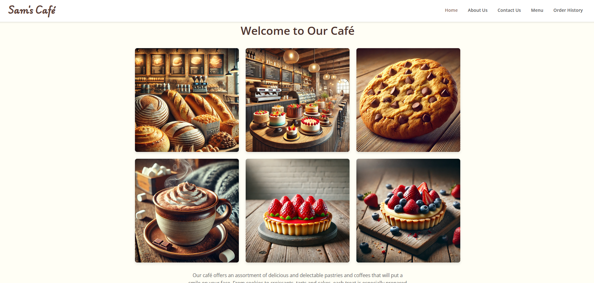
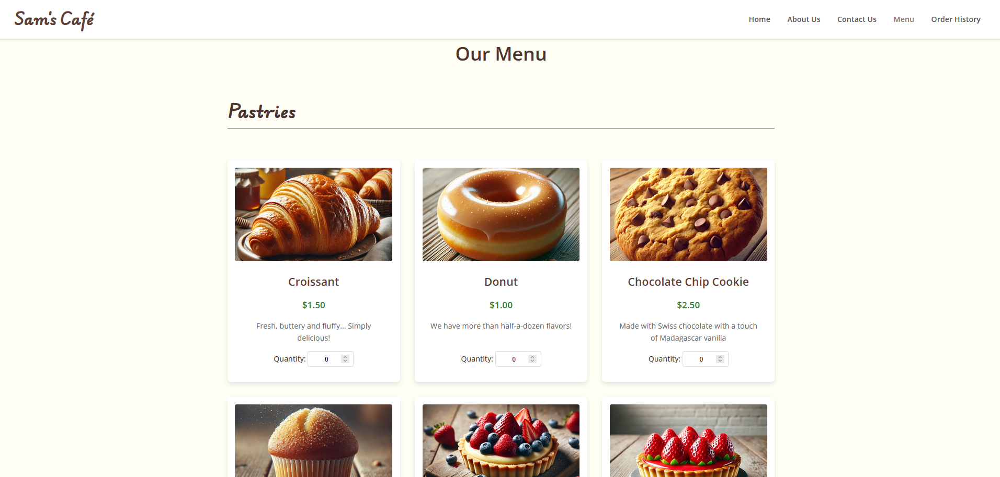
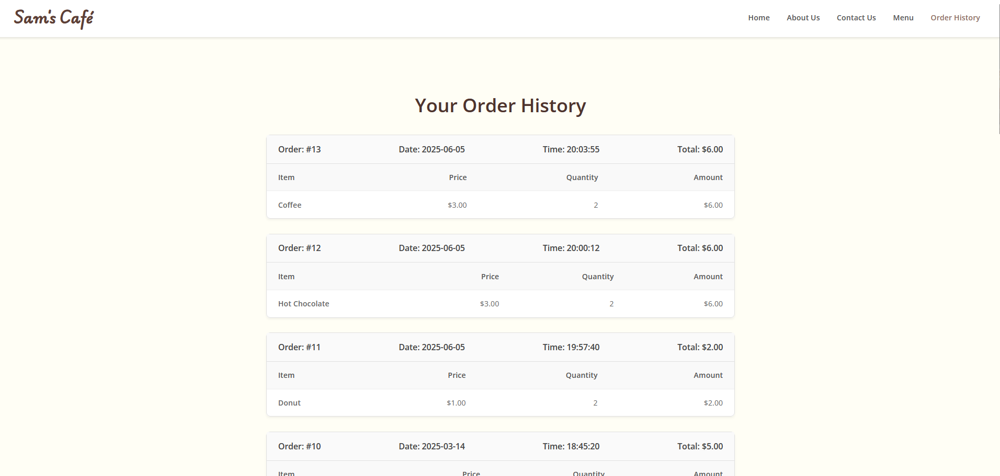
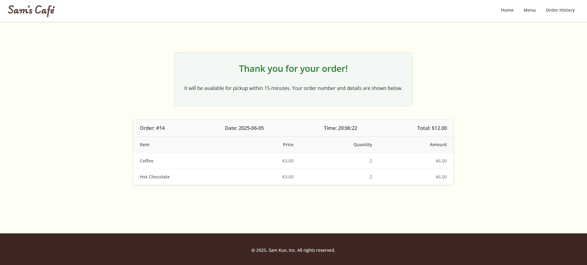

# Sam's Café Project

A coffee shop web application featuring a modern React frontend and a Node.js/Express backend, deployed on AWS.

## Tech Stack

**Frontend**
- React 19 + Vite
- React Router v7
- Tailwind CSS
- Axios

**Backend**
- Node.js + Express 5
- MySQL2 (MariaDB)
- AWS SDK (SSM Parameter Store)
- dotenv / CORS

## Project Structure

```
samcoffee/
├── samcoffee/               # React + Node.js (current version)
│   ├── frontend/            # React (Vite) frontend
│   │   └── src/
│   │       ├── api/         # Axios API client
│   │       ├── components/  # Navbar, Menu, OrderHistory
│   │       └── pages/       # Home, MenuPage, OrderHistoryPage
│   └── backend/             # Node.js + Express backend
│       └── src/
│           ├── config/      # db.js (MySQL), ssm.js (AWS SSM)
│           └── routes/      # menu.js, orders.js
└── samcafe/                 # Legacy PHP + MariaDB version (deprecated)
```

> **Note:** `samcafe/` is an older version of the framework, based on PHP and MariaDB, and is no longer maintained. For the current version, please refer to `samcoffee/`.

## AWS Architecture

For detailed information on the AWS cloud architecture, please see the [**AWS Architecture Documentation**](AWS_arch.md).

## Demo Website

A live version of this project is deployed on AWS:
[https://samkuo.click/](https://samkuo.click/)

## Screenshots






## Local Setup

### Prerequisites

- Node.js 18+
- MariaDB

### 1. Database Setup

Unzip `db.zip` and import the `.sql` file into your MariaDB server.

### 2. Backend

```bash
cd samcoffee/backend
cp .env.example .env
# Fill in your DB credentials and AWS settings in .env
npm install
npm run dev
```

The backend runs on `http://localhost:3000` by default.

### 3. Frontend

```bash
cd samcoffee/frontend
npm install
npm run dev
```

The frontend runs on `http://localhost:5173` by default.
