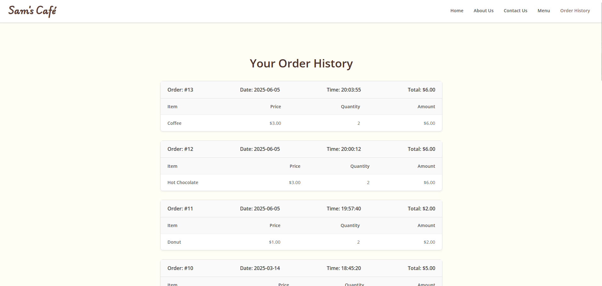

# Sam's Café Project

This is a demo project for a coffee shop website, featuring a modern user interface and a backend powered by PHP and MariaDB.

## Demo Website
A live version of this project is deployed on AWS. You can view it here:
[https://samkuo.click/samcafe/index.php](https://samkuo.click/samcafe/index.php)

## Screenshots
 
 
 
 

## Local Setup

To run this project on your local machine, you will need a PHP development environment (e.g., XAMPP, MAMP, or the PHP built-in server) and a MariaDB/MySQL database.

1.  **Database Setup:**
    *   Unzip the `db.zip` file located in the project root.
    *   Import the resulting `.sql` file into a new database in your MariaDB/MySQL server.

2.  **Configure Connection:**
    *   Open the `samcafe/getAppParameters.php` file.
    *   Inside the `if ($is_local)` block, update the following variables with your local database credentials:
        *   `$db_name = "your_database_name";`
        *   `$db_user = "your_username";`
        *   `$db_password = "your_password";`

3.  **Run the Server:**
    *   Navigate to the `samcafe/` directory in your terminal.
    *   Start the PHP built-in web server:
        ```bash
        php -S localhost:8000
        ```

4.  **View the Website:**
    *   Open your web browser and go to `http://localhost:8000`.

## AWS Architecture

For detailed information on the AWS cloud architecture used to deploy the live version of this project, please see the [**AWS Architecture Documentation**](AWS_arch.md).


